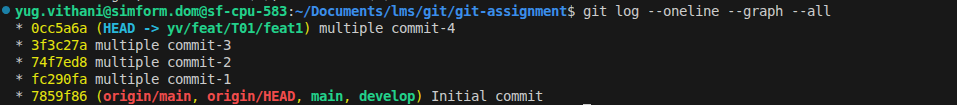
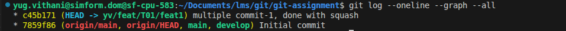
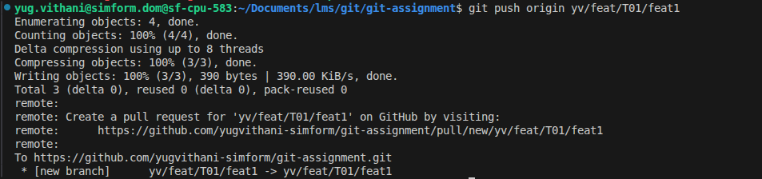
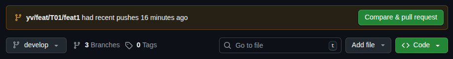
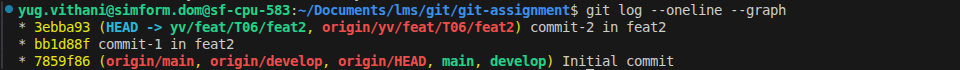
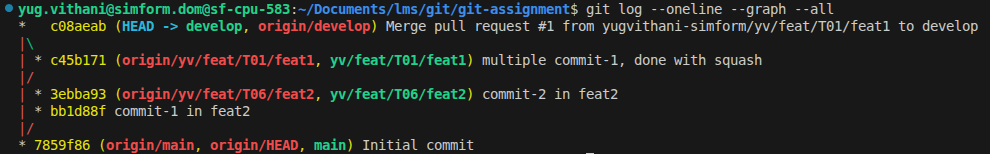
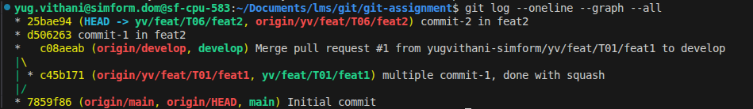
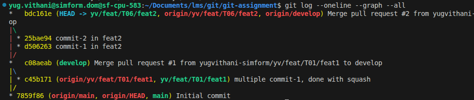
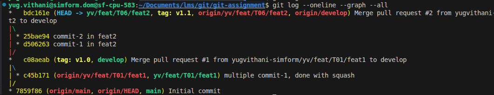
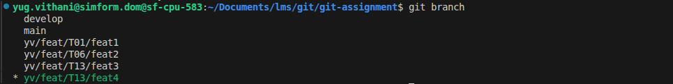

# Git Assignment

- Create a branch from develop named yv/feat/T01/feat1 and checkout in it.
```
git checkout -b <branch-name>
```

- commit-msg hook, which verify the length of the commit message must be greater than 10.
```bash
#!/bin/bash

commit_msg_file="$1"
commit_msg=$(cat "$commit_msg_file")
commit_length=${#commit_msg}

if [ "$commit_length" -le 10 ]; then
  echo "Commit message too short!"
  echo "Must be more than 10 characters."
  echo "Your message length: $commit_length"
  exit 1
fi

exit 0
```

- Multiple commits in the new branch

- Squash opration in multiple commit
```
git rebase -i HEAD~N (combine N commits)
```



- Create a Pull Request 

- Make the PR to develop


- Create a new branch from the develop, named yv/feat/T06/feat2
```
git checkout -b <branch-name>
```

- Make some commits in current branch and push it.


- Accept the pull request in the develop branch.


- Make the yv/feat/T06/feat2 branch up to date with the develop so do rebase and push it.
```
git rebase develop
```


- Create a PR from develop to yv/feat/T06/feat2


- Attach tag to commit
```
git tag <tag-name> <commit-id>
```


- Create two new branch from the develop

